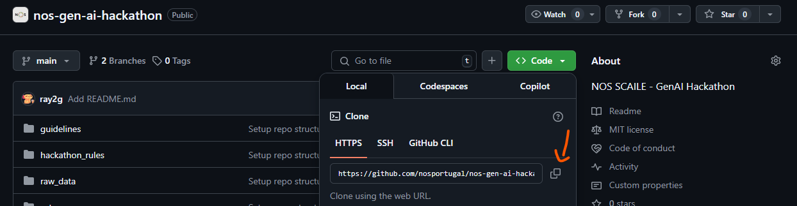

# 🌱 Git Basics: A Quick Tutorial

This README walks you through the essential Git commands and workflow for contributing to a GitHub project. Perfect for beginners!

---

## 📦 1. Forking a Repository

A **fork** is a personal copy of someone else's project. You can make changes in your fork and propose them to the original repo.

### 🔧 How to fork:

1. Go to the repository on GitHub (https://github.com/nosportugal/nos-gen-ai-hackathon.git)
2. Click the **Fork** button at the top-right.
3. GitHub creates a copy of the repo under your account.


---

## 📥 2. Cloning Your Fork Using HTTPS in Google Colab

To clone a GitHub repository (or your fork) using Google Colab, you can use the "!" command to run shell commands directly in a code cell. Here’s how you can do it using HTTPS:

🔗 Where to find the link:
1. **Open Google Colab**:
    Go to Google Colab and create a new notebook.
2. **Navigate to Your Fork**:  
   Go to your GitHub account and find your fork of the repository. It will be listed under your username.
3. **Get the Clone URL**:  
   - Click the green **Code** button located near the top right of the repository page.
   - Ensure that the **HTTPS** option is selected (you can toggle between **HTTPS** and **SSH**).
   - Click the copy icon next to the URL to copy it to your clipboard. It will look like this:  
     `https://github.com/nosportugal/nos-gen-ai-hackathon.git`



4. **Navigate to Your Desired Directory**:  
   Use the `cd` command to change to the directory where you want to clone your fork. For example:
   ```
   %cd path/to/your/directory
    ```
5. **Clone Your Repository**:
    ```
    !git clone https://github.com/nosportugal/nos-gen-ai-hackathon.git

    %cd repository-name  # Move into your desired subdirectory

    %cd ..  # Move up one level
    ```
6. **Now You Can Work with Your Files**:

    After cloning, you can view, edit, and run any scripts or files in your repository.

---

## 🌿 3. Creating and Switching to a Branch

Always create a new branch for your work to keep things organized.

```
!git checkout -b my-branch
```

---

## ✏️ 4. Making Changes & Committing

After making changes to your code:

1. Add your changes:
    ```
    !git add . # stages **all** modified and new files in the current directory and its subdirectories.
    ```
    If you only want to stage a specific file, you can do:
    ```
    !git add filename.py
    ```
    This is useful when you want to commit only certain changes, not everything. You can list as many files as you want, separated by spaces.

2. Check you remotes
    ```
    !git remote -v
    ```
3. Commit them with a meaningful message:
    ```
    !git commit -m "Add feature: meaningful description"
    ```
    You might see an error asking you to set your identity.
4.  Set Git identity (only needed once per environment):
    ```
    !git config --global user.email "user@gmail.com"
    !git config --global user.name "YOUR NAME"
    ```
    
    Then re-run the commit command:
    ```
    !git commit -m "Add feature: meaningful description"
    ```

---
## 🔐 5. Creating a Classic GitHub Token (for HTTPS Authentication)

Since GitHub no longer allows password authentication via HTTPS, you'll need a **classic personal access token**.

### How to create a token:

1. Go to: [https://github.com/settings/tokens](https://github.com/settings/tokens)
2. Click **"Generate new token (classic)"**
3. Add a note like `"Colab Git Access"`
4. Set an expiration date (optional but recommended)
5. Select scopes:
   - `repo` (Full control of private repositories)
6. Click **"Generate token"**
7. **Copy and save the token** – you won’t see it again!

---

## 🚀 5. Pushing to GitHub

After you’ve created your personal access token, set the correct remote URL using your GitHub username and your token.

1. Update the remote URL:

```
!git remote set-url origin https://<user-id>:<token>@github.com/<user-id>/<nome-do-repo>.git
```
2. Push your branch:
```
!git push -u origin my-branch
```

---

## 📬 6. Opening a Pull Request (PR)

Once your branch is pushed:

1. Go to your fork on GitHub.
2. Click **"Compare & pull request"**.
3. Review your changes and submit the PR.
